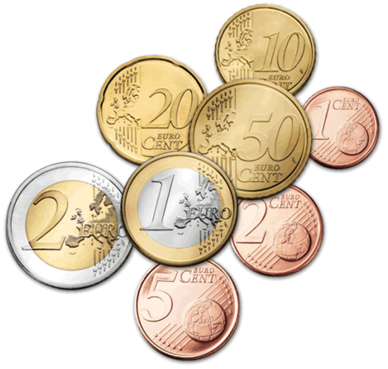

# Minimum Coin Change
Minimum Coin Change problem algorithm implemented in Swift comparing dynamic programming algorithm design to traditional greedy approach.

Written for Swift Algorithm Club by Jacopo Mangiavacchi

# Introduction

In the traditional coin change problem you have to find all the different ways to change some given money in a particular amount of coins using a given amount of set of coins (i.e. 1 cent, 2 cents, 5 cents, 10 cents etc.).

For example using Euro cents the total of 4 cents value of money can be changed in these possible ways:

- Four 1 cent coins
- Two 2 cent coins
- One 2 cent coin and two 1 cent coins

The minimum coin change problem is a variation of the generic coin change problem where you need to find the best option for changing the money returning the less number of coins.

For example using Euro cents the best possible change for 4 cents are two 2 cent coins with a total of two coins.

# Greedy Solution

A simple approach for implementing the Minimum Coin Change algorithm in a very efficient way is to start subtracting from the input value the greater possible coin value from the given amount of set of coins available and iterate subtracting the next greater possible coin value on the resulting difference.

For example from the total of 4 Euro cents of the example above you can subtract initially 2 cents as  the other biggest coins value (from 5 cents to above) are to bigger for the current 4 Euro cent value. Once used the first 2 cents coin you iterate again with the same logic for the rest of 2 cents and select another 2 cents coin and finally return the two 2 cents coins as the best change.

Most of the time the result for this greedy approach is optimal but for some set of coins the result will not be the optimal.

Indeed, if we use the a set of these three different coins set with values 1, 3 and 4 and execute this  greedy algorithm for asking the best change for the value 6 we will get one coin of 4 and two coins of 1 instead of two coins of 3.

# Dynamic Programming Solution

A classic dynamic programming strategy will iterate selecting in order a possible coin from the given amount of set of coins and finding using recursive calls the minimum coin change on the difference from the passed value and the selected coin. For any interaction the algorithm select from all possible combinations the one with the less number of coins used.

The dynamic programming approach will always select the optimal change but it will require a number of steps that is at least quadratic in the goal amount to change.

In this Swift implementation in order to optimize the overall performance we use an internal data structure for caching the result for best minimum coin change for previous values.

